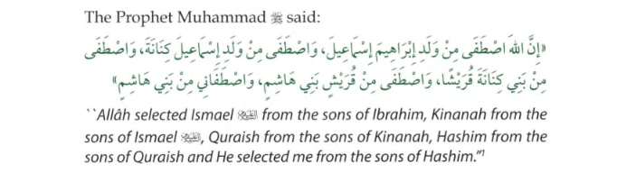
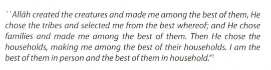
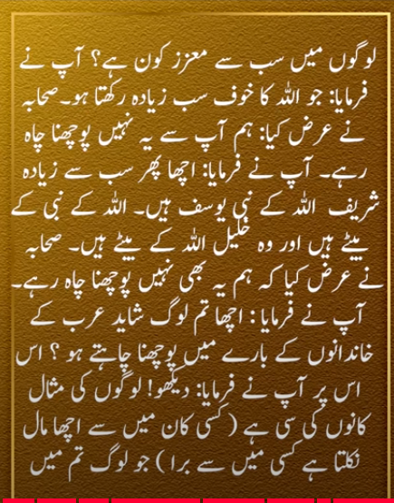

# The Lingage and Family of Prophet Muhammad [SAW]
With respect to the lineage of Prophet Muhammad [pbuh], there are three versions:

-  The first was authenticated by biographers and genealogists and states that Muhammad’s genealogy has been traced to ‘Adnan. 

### Authentic 
```
Muhammad bin ‘Abdullah bin ‘Abdul-Muttalib (who was called Shaiba) bin Hashim, (named ‘Amr) bin ‘Abd Munaf (called Al-Mugheera) bin Qusai (also called Zaid) bin Kilab bin Murra bin Ka‘b bin Lo’i bin Ghalib bin Fahr (who was called Quraish and whose tribe was called after him) bin Malik bin An-Nadr (so called Qais) bin Kinana bin Khuzaiman bin Mudrikah (who was called ‘Amir) bin Elias bin Mudar bin Nizar bin Ma‘ad bin ‘Adnan. 
```

- The second is subject to controversies and doubt, and traces his lineage beyond ‘Adnan back to Abraham. 

```
‘Adnan bin Add bin Humaisi‘ bin Salaman bin Aws bin Buz bin Qamwal bin Obai bin ‘Awwam bin Nashid bin Haza bin Bildas bin Yadlaf bin Tabikh bin Jahim bin Nahish bin Makhi bin Aid bin ‘Abqar bin ‘Ubaid bin Ad-Da‘a bin Hamdan bin Sanbir bin Yathrabi bin Yahzin bin Yalhan bin Ar‘awi bin Aid bin Deshan bin Aisar bin Afnad bin Aiham bin Muksar bin Nahith bin Zarih bin Sami bin Mazzi bin ‘Awda bin Aram bin Qaidar bin Ishmael son of Abraham [AWS]
```

- The third version, with some parts definitely incorrect, traces his lineage beyond Abraham back to Adam [AWS].

```
The third part: beyond Abraham [AWS] , Ibn Tarih (Azar) bin Nahur bin Saru‘ bin Ra‘u bin Falikh bin Abir bin Shalikh bin Arfakhshad bin Sam bin Noah [AWS] , bin Lamik bin Mutwashlack bin Akhnukh [who was said to be Prophet Idris (Enoch) [AWS]] bin Yarid bin Mahla’il bin Qainan bin Anusha bin Shith bin Adam [AWS]
```

## Meternal Lingage 
```
"Amina bint Wahb, bin Abd Manaf, bin Zuhra, bin Kilab.
From this lineage, the ancestry continues forward."
```

##









