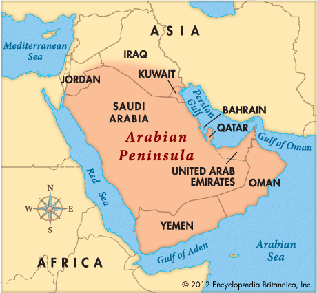

# Arab
## Location of Arabs 
Linguistically, the word "Arab" means deserts and waste barren land well-nigh waterless and treeless. Ever since the dawn of history, this term used for Arabian 

Peninsula and its people .
The Arabian Peninsula is enclosed in the west by the Red Sea and Sinai, in the east by the Arabian Gulf, in the south by the Arabian Sea, which is an extension of the Indian Ocean, and in the north by old Syria and part of Iraq. The area is estimated between a `one million and three hundred tousend sq miles.`

Thanks to its geographical position, the peninsula has always maintained great importance.. Considering its internal setting, it is mostly deserts and sandy places, which has rendered it inaccessible to foreigners and invaders, and allowed its people `complete liberty and independence through the ages, `despite the presence of two `neighbouring great empires.-> Romen , Persian `

Its external setting, on the other hand, caused it to be the centre of the old world and provided it with sea and land links with most nations at the time. Thanks to this strategic position the Arabian Peninsula had become the centre for trade, culture, religion and art.

## Arab Tribe 
Arab kinfolks have been divided according to lineage into three groups :-

`1.Perished Arabs`: The ancient Arabs, of whose history little is known, and of whom were ‘Ad, Tham?, Tasam, Jadis, Emlaq, and others.

`2.Pure Arabs:` Who originated from the progeny of Ya‘rub bin Yashjub bin Qahtan. They were also called QahtanianArabs.

`3.Arabized Arabs`: Who originated from the progeny of Ishmael. They were also called ‘Adnanian Arabs.
