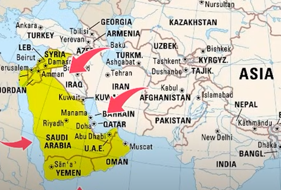
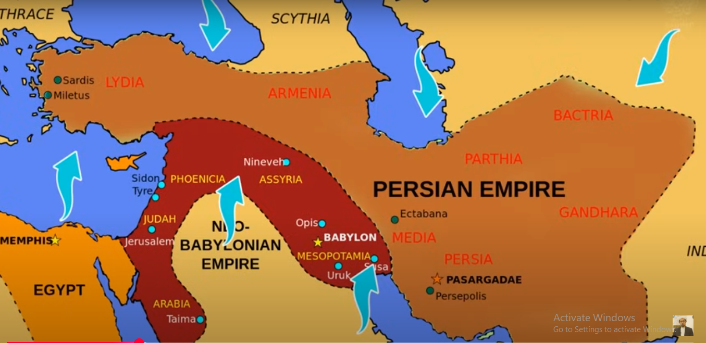
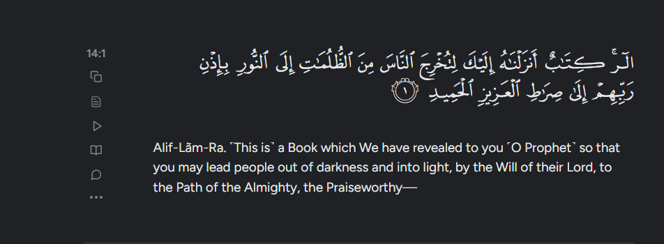
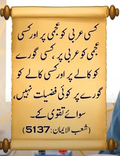
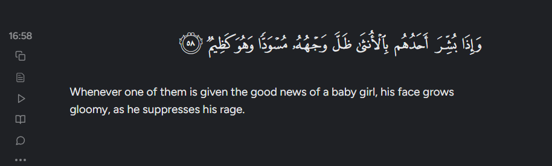
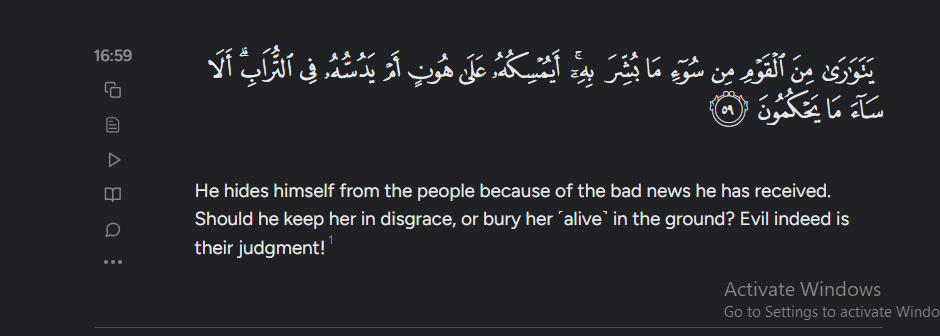

Peace and blessings be upon Prophet Muhammad. In the name of Allah, the Most Gracious, the Most Merciful. We praise Him and send blessings upon His noble Messenger. 

Our Seerah course is ongoing, and before we start today's class, as always, I want to remind you to recite Durood Sharif a lot during and before the Seerah class. The more we send blessings upon the Prophet Muhammad (peace be upon him), the more Allah will bless us with true love for him. And may Allah help us to follow the Seerah we are learning.

May we be granted success. My second request is that when you listen to the Seerat, do so with this intention: that in our weekly lessons, whatever we learn from the Seerat, we truly understand it well. Listen with the purpose of applying it in your life and becoming someone who invites others to follow this path. Start listening to every class with this mindset. I pray to Allah that it will benefit you greatly. Try to listen with your family, children, and friends. Take notes and pay as much attention as possible.

Listen not just once, but again and again. Maybe you won’t understand everything the first time. When you listen a second, third, or fourth time, it’ll make a lot more sense. Today’s topic is about the conditions before the Prophet Muhammad’s (peace be upon him) mission—his time, the geography, which religions existed, which religion was dominant in which country, and what people believed and thought. This helps us understand the situation Allah sent His final Prophet, Muhammad (peace be upon him), into this world, and how he came into it.

How did the fastest revolution in the world happen—an unprecedented revolution in all of human history? In just 22 years, the Prophet (peace be upon him) completely transformed the entire world. To understand this, we need to know some geographical terms and concepts. It's important because when we talk about the Prophet's life (Seerah), it’s part of history, and history and geography are closely connected—you can’t separate one from the other. This is because when you're studying the Seerah, you're also learning history, and to fully grasp history, you need to understand geography as well.

You'll often hear things like "this is in the East," "that is in the West," "this is in the North," "that is in the South," or "this is south of that," "north of that." These words and terms come up again and again, but many of us don't really know what North, East, or West actually mean. So, these are some important terms you should understand. Whether you're reading a history book or learning about the Prophet's life, whenever these terms come up, at least you won’t get confused about geography.

There’s a term used called East, West, North, and South—you’ve probably heard of East, West, North, and South. What do they mean? East, West, North, and South mean that if you have a map in front of you, and for example, you’re standing in Pakistan right now, then the area on your right side is called East, or "Mashriq" in Urdu. The area on your left side is called West, or "Maghrib." The area above you on the map is called North, and the area below you is called South.

South is a basic geographical concept—directions are the four main ones: east, west, north, and south. You need to know them. So, for example, when we say that the Persian Gulf is to the east of the Arabian Peninsula, it means the Persian Gulf is on the right side of the Arabian Peninsula. When we say the Red Sea or the Gulf of Aqaba is to the west of the Arabian Peninsula, it means these are on the left side. Similarly, when we say that Syria, Jordan, and Palestine are to the north of the Arabian Peninsula, it means they’re located above it.

And when we say that Yemen and these areas are in the south of the Arabian Peninsula, it means the lower part of the Arabian Peninsula is called the south. So first of all, we should know these four directions because we often hear and use these terms, so we need to understand them. You know, we live in Pakistan, and Saudi Arabia is to the left of us, so our Qibla is towards the west. That’s why we face west when we pray, meaning we turn to the left side to pray. Okay, that’s one term explained. Now, let’s understand the second term about the Arabian Peninsula.

The term is used frequently. It’s called Jazirat al-Arab, also known as the Arabian Peninsula in English. You know what an island is, right? It means a piece of land surrounded by water on all sides. But when we talk about Jazirat al-Arab, it’s not a full island because it’s surrounded by water only on three sides, not all four. The two holy cities of Mecca and Medina, the Haramayn Sharifayn, are located in Jazirat al-Arab. So, this peninsula has water on its east, west, and...

To the south, east, and west, there’s water, and to the north, there’s land. So it’s surrounded by water on three sides but not on the fourth, which is why it’s not called an island but a peninsula. It’s called the Arabian Peninsula because it’s not exactly an island, but it’s kind of like one. In English, we say "Arabian Peninsula." So, the difference between an island and a peninsula is like this. In Arabic, we also call it "Jazirat al-Arab" or sometimes "Juzur al-Jazira." The main thing to keep in mind is what exactly is meant by an island when we talk about the Arabian Peninsula.

This refers to the whole region. I'll try to show you a map in the video that shows how it's currently divided into about 12 countries. It includes Saudi Arabia, Yemen, Qatar, Bahrain, the UAE. Then, if you move up north, there's Syria, Jordan, Lebanon, Palestine. All these countries—Bahrain, Oman—this entire area is called the Arabian Peninsula. Right now, it's split into 12 countries. These are the various Muslim countries, often called the Gulf countries, and some people refer to this area as the peninsula or the Arabian Peninsula.

Sure thing! Here's the translation in natural, everyday English:

"So, it’s about the Arabian Peninsula. Now, there’s another term that’s used—'Gulf' or 'Gulf.' You’ve probably heard of the Persian Gulf or the Arabian Gulf. So, the word 'gulf' basically means the opposite of a peninsula. Remember, a peninsula is a piece of land surrounded by water on three sides. A gulf is the other way around—it’s a body of water that’s surrounded by land on three sides. Like, a big sea where a narrow passage lets the water flow inside, leading to another sea, lake, or smaller body of water."

But it’s surrounded by land on three sides, and on one side there’s a path that goes inside. This is called a bay or a gulf. Now, moving on to the location of the Arabian Peninsula—where exactly is it? What’s its position? To the east of the Arabian Peninsula is the Persian Gulf, also known as the Gulf of Persia. Okay? To its west is the Red Sea, also called the Bahr al-Ahmar or the Sea of Kilm. This is the same sea where Pharaoh drowned, as mentioned in the story of Prophet Moses (peace be upon him).

God saved him. You should understand that there’s a sea between Asia and Africa called the Red Sea, also known as the Bahr al-Qulzum. It’s commonly believed here that Pharaoh drowned in the Nile River, but that’s not true. He actually drowned in the Red Sea, the Bahr al-Qulzum. Africa, specifically Egypt, is part of Africa, and Pharaoh was trying to come from there towards this side. To the east of the Arabian Peninsula is the Persian Gulf, and to the west of the Arabian Peninsula is the Red Sea or Bahr al-Ahmar. If you go south from there, you’ll reach the Arabian Sea.

What’s called the Arabian Sea is here, and below that is the Indian Ocean. So that means there’s water on the right side, water on the left side, and water below. And to the north, or above, I told you there’s Syria, Palestine, Lebanon—these countries. Then moving further ahead, the area of Syria connects with Turkey and other countries. So this area, in terms of its direction, has land, not water. That’s the location. And if you look at it from a continent perspective, you know about the continents, and you know about the Arabian Peninsula in Saudi Arabia.

This is all within Asia, so it's Asia. To the right is Africa—sorry, to the left in the west is Africa—and above that, to the north, is Europe. You should know that when the Prophet Muhammad (peace be upon him) was sent, the known continents in the world were these three. You know America was discovered much later, Australia was discovered much later. The known continents back then were Asia, Africa, and Europe—these three. So that’s the location of the Arabian Peninsula. Now, after that, we come to the time of the Prophet Muhammad’s (peace be upon him) mission.

Which countries existed around that time, or which big empires were there back then? What were their conditions like—their religious state, their morals, their civilization, their culture, their ethics, their character, society, economy, and politics? Where were they standing in terms of development and status? Understanding all this is important because when we later study the life of the Prophet Muhammad (peace be upon him), and the revolution he brought through his teachings and the divine guidance he presented, we'll be able to see what changes actually took place.

Back then, there were two big empires everyone knew about. One was called Persia, and the other was Rome. The Persian Empire and the Roman Empire were basically the superpowers of that time. You could say they were the most advanced and developed kingdoms or empires people respected. The Persian Empire covered areas like Iran, Iraq, and parts of Azerbaijan.

Makran and Khorasan were regions in Persia, and the Roman Empire was divided into two parts: the Eastern Roman Empire and the Western Roman Empire. The Eastern Roman Empire included areas like Syria, Lebanon, Jordan, and Palestine—basically the Arabian Peninsula's northern part. These regions were under Roman control. That’s why, during the Prophet Muhammad’s (peace be upon him) military expeditions, when he traveled there, it was to fight the Romans. The capital of the Eastern Roman Empire was Constantinople, which is modern-day Istanbul in Turkey.

Think of it like this: one was the center or the capital of the Western Roman Empire, which was Italy. So both were called Rome—the Roman Empire—but one was the Eastern Roman Empire and the other was the Western Roman Empire. These were two big empires back then, along with the Persian Empire and the Roman Empire. You’ve probably heard the words Caesar and Khosrow before, and you’ll hear them again. Caesar was the title given to the Roman emperor, like his official name. And the Persian king was called Khosrow. So that’s what Caesar and Khosrow mean.

There were two big famous empires—the Roman Empire and the Persian Empire. Of course, there were other countries and people living around the world, but the most well-known civilizations back then were these two. Now, let's talk about their religious situation—what their religious status was. If we talk about Rome, the Roman Empire’s official religion was Christianity. They claimed to be followers of Jesus Christ. And if you study history...

You'll find in studies that historians have written about the 6th century AD—the century when the Prophet Muhammad (peace be upon him) was born and lived. This century is considered the darkest period, not just for Christianity but for human history as a whole. Morally, socially, and culturally, humanity was in a state of decline. If we talk specifically about Christianity during that time, especially in Rome, you'll see what conditions Christians were facing back then.

The teachings of Prophet Jesus (peace be upon him) weren’t a very detailed religion. The main thing was the belief in the oneness of God—that was the core subject, the main point he emphasized. Besides that, there were some other teachings, but it wasn’t a very elaborate religion. If you know some history, or if you don’t, you can study it, you’ll see that when Saint Paul came along, he started to change Christianity. He introduced all kinds of superstitions and ignorant customs into Christianity that weren’t originally part of Jesus’s teachings.

So when they started including all these things, Christianity completely lost its original face. It got totally distorted. Greek myths crept in, idolatry came in, Platonic ideas showed up, and monasticism took hold. It all mixed together into this strange blend. The original teachings of Jesus (peace be upon him) and the belief in one God were pushed aside. Instead, you got idolatry, superstitions, ignorant customs, and monasticism. It basically became just a symbol of a religion—a kind of religion where you'd have idol worshippers and monks who live detached from the world, and that’s what the religion turned into.

If someone has no connection with the world, they’ll be considered the greatest elder. These kinds of ideas have taken hold. Now, if you look at this concept—say, in a country where religious beliefs have boiled down to just lifeless rituals and ceremonies, where people think, “Just perform these few rituals and that’s religion,” and beyond that, religion or faith has no connection to your politics, society, economy, family, community, business, or practical life—then obviously, you know this kind of religion can’t bring about any revolution in the world. Such a religion can’t bring any real change.

Religion can’t solve the world’s problems. Back then, things were like this. Then the problem got worse when different sects started forming among the Christians—one group after another. They even started civil wars with each other. Some people began coming up with different beliefs about Jesus (peace be upon him). Some said Jesus had a human spirit as well as, God forbid, God’s own spirit inside him. Others said he had a human spirit, but it got so weak that God’s spirit replaced it, and they started worshipping him as a deity. You know, the Quran...

In the Quran, Allah talks about the different Christian sects. It says, "Those who say, 'Allah is the Messiah, son of Mary,'" have disbelieved. Some said that Allah is the Messiah, some said that Allah is one of three, the third of three. So they made Prophet Jesus (peace be upon him) a partner with Allah. Because of this, different sects formed and started fighting among themselves, leading to civil strife. That was their religious situation. Now, if we look at their social and political setup—how their political system worked, how they governed themselves, and what their social life was like—then...

If you look back at history, you’ll find it’s pretty common that their rulers imposed really harsh taxes on the people—taxes so heavy the people just couldn’t handle the burden. The public was so fed up with their rulers that they wished someone from outside would come and rule over them instead. But these tyrants who were forced upon them, they just wanted to find any way to be free from them. If you check out the kind of extravagance those rulers indulged in back then, and how the common people were suffering, especially the middle class, who, when they looked up at those above them, saw a totally different world.

Kings and rulers were all about their flashy lifestyles, luxury, and status. They were caught up in this race to have a lifestyle better than everyone else’s, always trying to outdo one another. Their entire lives revolved around that. The rulers lived like kings, imposing heavy taxes and all sorts of burdens on the people, making life really hard for them. You won’t find any sign of civilization, humanity, decency, ethics, or justice there.

There, everything was up for sale—bribery, corruption, betrayal, scams, and fraud. You can say it was all part of their culture, their society. That was the state of Rome. Religiously, they were so weak that they couldn’t bring about any revolution or change in the world. Politically and in terms of governance, they were so worn out and corrupt that even their own people were fed up with them. They were tired of their own people, but still, they held onto their monarchy and ruled over them.

So obviously, the main purpose of talking about this part of history is to understand the situation back then. Since these were the conditions, God had to change them somehow. Let’s take Rome, for example—it was the superpower at the time. This was their religious and political state. Clearly, they couldn’t bring any meaningful or righteous revolution to the world. If we talk about Europe—the northern and western countries, basically what we call Europe today—then in history, their...

You’ll clearly see that Europe at that time was stuck in history. Obviously, Muslims hadn’t established Andalusia yet—they hadn’t conquered what is now Spain or brought the light of knowledge there. It was only many centuries later that Europe started to shine with knowledge, learning from the Muslims. They took those sciences, worked hard on them, and then made progress. But you won’t find any mention of their civilization, science, or arts playing a role in improving the world’s political or economic systems.

They didn’t really play any role in the improvement; in fact, they didn’t have any role at all at that time. Now, let’s talk about the Persian Empire—what their situation was like, their religious, political, economic, and moral conditions. Most people in the Persian Empire were Zoroastrians, meaning they worshipped fire. The system there was a monarchy, a king-based system. The kings themselves claimed that divine blood ran through their veins, and they believed this about themselves.

They used to make their people believe that the king comes from the family of kings, and every member of the king’s family has rights over every single person in their nation, while the people have no rights over their kings. This was something they were formally taught; it was part of their ideology and belief that kings have rights over the people’s wealth and everything else, but the people have no rights over the kings. It’s like how in Hindu society you have different castes—Brahmins, Shudras—the elite class or elite caste rules. That same idea was present among the Magi of Iran, and that’s why.

They had great respect for their kings and would bow down to them—they basically worshipped them. Like I told you, their religion was that they worshipped fire. Now, you tell me, if a person or a whole nation worships fire, does fire have the ability to guide them on what their political system should be, what their economic system should be, what their social system should be, what their rituals and customs should be, or what their beliefs should be to improve the world’s system?

What should the character be like? If someone could explain all this, obviously they can’t. So that means the people of the Persian Empire, the idol or the thing they worshipped as God, religiously speaking, they didn’t really have the status to lead the world, guide it, or provide any instructions or guidelines. And if we talk about their moral and cultural state, the behavior and character of the people living in Persia had sunk so low that maybe you and I can’t even imagine it. I sincerely apologize.

I want to talk about some things that might be a bit against modesty, but since I’m discussing history, it’s important to understand this. After that, I want to explain how the Prophet (peace be upon him) sparked a revolution. This will help you understand the kind of change he brought to the world and what caused it. I also want to relate this to what’s happening in today’s world—comparing the conditions back then with the ones now.

What’s the solution to these issues according to the teachings of the Prophet’s life? The moral decay was so deep that women had no status at all. There was a group called the Zoroastrians, and among them, some believed it was okay to marry their own daughters. One of their famous kings, Yazdegerd II, married his own daughter and then killed her. Another king, Bahram, who ruled in the 6th century AD, married his sister. This kind of unnatural behavior was considered wrong even back then by all civilized societies—marrying your own sibling was totally unacceptable.

A daughter can’t marry her mother; these sacred and respected relationships are such that marriage isn’t allowed. But morally, they were pretty degraded—they didn’t see her as having any status at all. Going further, among the Persians, or Iranians, there was another sect called the Mazdakites, named after a man named Mazdak. He proposed this theory that, like water, fire, and air belong to everyone and no one can claim exclusive rights, similarly, brothers have equal rights over women. Just like anyone can drink water from anywhere because it’s common to all, air is free for everyone, and so on.

Women are a part of this world, and every person has rights over them—just like they have rights over water, air, and fire. Similarly, they have rights over women. Because of this, those immoral, reckless, and lazy people obviously took advantage. You can imagine how things changed for them—they felt like everything became allowed for them. They didn’t just stop there; they gave it a legal cover and even wrapped it in religion, presenting it as a religious freedom, claiming that their religion permits it. That was their state. This moral decline is recorded in historical books. A Chinese traveler wrote about it.

They wrote in their book that when they visited Iran back then, they traveled around and observed something. A Chinese traveler wrote that there’s nothing sacred about marriage relations there. He said that in Persia, there were no special rules or exceptions when it came to marital relationships. So you can understand from that that even someone who came from China, just traveling around, thought this was wrong. That was their moral state. Now, I already told you about the religious condition of that nation—they worshipped fire—and if their morals were like that...

When it comes to decline, they had fallen so low morally that they were obsessed with kingship to the point where they used to prostrate before their kings. Can a nation in such a state really lead the world? Allah says in the Quran, "This book, we have sent it down to you so that you may bring people out of darkness into light." This shows how deep in darkness and moral decay humanity was—what kind of corruption had taken over their character, ethics, and religion, and what kind of downfall they were suffering. Then Allah sent His Messenger, and the Messenger of Allah...

Through the teachings of revelation, humanity was taken to great heights. Now, if we go even further and talk about China, obviously it’s located in the East, in the eastern part of the world, even east of the Arabian Peninsula. So, if we talk about Buddhism, Buddhism and Hinduism were originally two separate religions. But if we look at the 6th century AD, Buddhism and Hinduism had almost merged into one. In other words, the things practiced by Hindus—the avatars and gods they worshipped—Buddhists also adopted those same avatars and gods, recognizing and worshipping them too.

They started doing it, and basically, you can think of Buddhism as a kind of idol worship religion. Wherever they went, they carried idols with them and installed statues of Gautam everywhere. So, their religion was a mix of Buddhism and Hinduism—that was their religion or culture. If you look at it, the people of China back then lived kind of isolated from the rest of the world, like they didn’t want to learn from anyone or teach anyone else. Even today, if you look at China, their mindset and psychology are still like that.

You know, Google, YouTube, and all that stuff are banned there. They have their own search engine, their own video platforms, everything is their own. They neither use Google or YouTube nor allow anyone else to use them. So even back then, their mindset was clear—China was obviously dominating in many areas. But their mindset was that they neither needed to learn from anyone nor teach anyone; they were just absorbed in their own world. Obviously, this community or group was isolated from the rest of the world.

They didn’t really have any message to bring a revolution in the world’s civilization and culture. When it comes to India, you know Hinduism has been around since ancient times. Maulana Syed Abul Hasan Ali Nadwi wrote about this in his book, which talks about the rise and fall of Muslims and its impact on humanity. Historians agree that Hinduism was going through its worst phase back then—that is, the people there were facing a really bad time morally.

The caste system and how women were treated there—you know how in Hinduism women were sometimes forced to commit sati and were treated badly and all that. So, in that regard, they faced really terrible conditions. India, too—just understand the situation back then. I told you about the conditions under the Persian Empire, the Roman Empire, China, and India. Now, let's move on to the situation in the Arabian Peninsula itself, and from there we'll move forward to talk about how Allah sent His last prophet.

Why this place was chosen, and then we’ll come to why Allah chose Prophet Muhammad (peace be upon him) in this place too. Once you understand these things, when you read the Seerah, God willing, you’ll be able to understand it much better. Now, if we talk about the Arabian Peninsula, especially its kingdoms, you should know that the Arabian Peninsula has always held an important place in world history. The people of ‘Aad and Thamud, whom we read about in the Quran, were from this very region. So, you can say that the people of Thamud were also from the Arabian Peninsula.

Up north, there was the tribe of ‘Ad, located in the southern part of the Arabian Peninsula, towards Yemen. Similarly, we hear about the tribe of Saba, which was also near Yemen. Various kingdoms existed here, but most of them were before Christ. Among them were the kingdoms of Saba, Hadramaut, Nabateans, Ma’in, and Qataban. These different kingdoms ruled here, but most were pre-Christian. During the time of the Prophet (peace be upon him), the political system in the Arabian Peninsula was basically a tribal system, meaning each tribe...

There used to be a tribal chief who was basically in charge of protecting the tribe. If anyone attacked the tribe, everyone would come together and fight to defend it. You could say that back then, these people lived like independent citizens without any formal government ruling over them, except for a few areas I mentioned. Parts of the Arabian Peninsula, especially the northern regions like Syria, Jordan, Palestine, and Lebanon, were under Roman control. So those areas were ruled by the Romans. As for the region of Yemen...

The southern region was controlled by the kings of Abyssinia, meaning they came from Africa and established their rule here. You know about Abraha, who sent an army to destroy the Kaaba. Abraha was actually a ruler appointed by the people of Abyssinia over parts of Yemen. He was a Christian, and he carried out that mission. So, in some areas, you could say they had colonial control—using today's terms, they had occupied those places. In the eastern regions, like Bahrain and some other areas, the Persian Empire had control. But...

The heart of the Arabian Peninsula—the center, including Mecca and Medina, basically what we now call Saudi Arabia—was once home to independent tribes with no formal government ruling over them. Because of that, their nature was very different from that of enslaved people. They were brave and fierce fighters. You know, one unique trait of the Arabs—whether you see it as a flaw or a strength—is that they craved war like a person craves a good meal. War was almost their favorite pastime; if there was a problem, they’d jump at the chance to fight.

They had all their poetry, verses, and odes focused on wars. You’ll find all their poems centered around that. Along with that, their command over language—their eloquence, or you could say fluency and style of speaking—was something they were really proud of. They used to say, “Our way of speaking is exceptional; no one can talk like us.” That’s why, when it comes to the Arabs in Hadith, as we’ve heard and you probably have too, no Arab was considered superior to a non-Arab just because of their language. The superiority they claimed over non-Arabs was because of their language—because the way they spoke and their mastery of conversation was unmatched anywhere in the world.

We have superiority over them because we can do it. The Prophet of Allah (peace be upon him) made it clear: there is no superiority of an Arab over a non-Arab, nor a non-Arab over an Arab; no white person is superior to a black person, nor a black person to a white, except by piety. In the eyes of Allah, the only standard is piety. They took pride in their way of speaking and their language skills. Likewise, they were very straightforward people—they didn’t sugarcoat things and spoke plainly. Whatever was on their mind, they said it openly. Their general national character was to be completely frank and straightforward, speaking clearly and directly.

People who do these things have always been known for their honesty and hospitality, which is a special trait of the Arabs. Even today, if you visit Arab countries, you’ll clearly see that their hospitality and generosity seem like something inherited, passed down through generations. These qualities still stand out in them. But if we talk about their moral state, the people living in the Arabian Peninsula had many moral issues. You know, the Quran mentions that Arabs were heavily addicted to alcohol and used to drink a lot.

So, back then, drinking alcohol was actually seen as something to be proud of—they were addicted to it. Women had no status at all. The Quran mentions that on the Day of Judgment, when they ask a buried alive girl about the sin or crime she was buried for, you'll understand. People used to consider the birth of a girl a bad thing, and as soon as a girl was born, they would bury her alive. There were many cases where girls reached adulthood but still didn’t get a chance, and even at that age, they were buried alive. You can find such incidents in the books of Seerah (Prophet’s biography), history, and Hadith collections. Later on...

People became Muslims, and when they confessed how they used to bury their daughters, those stories were so heartbreaking, so painful that you couldn’t even bear to hear them. That was their situation. The Quran mentions that when good news of a baby girl is given, the person’s face turns dark, and they hide from their people, thinking, “What will I tell my tribe that a daughter was born to me?” Along with that, women were looked down upon so much that they were completely degraded.

When someone passed away, the inheritance was handled in a certain way. For example, if they left behind property like money, silver coins, horses, or camels, it would be passed down to the heirs. Women were also given their share of the inheritance just like that. They’d be told, "This woman is part of your inheritance, you get her share," and so on. If her husband died, she wasn’t allowed to remarry. Also, during her mourning period, she would be kept isolated in separate rooms, and people wouldn’t talk to her.

Their cooking was considered inedible. Women, in particular, faced extreme degradation and moral decline. Arab society was full of usury—it was completely common. Robberies and looting were everyday things. The Quran says they didn’t care that God made the sacred sanctuary a place of peace, yet people were still being snatched there. Travelers were robbed on the roads. Usury was practiced cruelly and excessively. The Quran forbade usury, telling them, “You keep charging interest on interest, compounding it over and over.”

Save yourself. Don’t get caught up in foolishness or compound interest. Charging interest was common in their society, as were drinking, immorality, nudity, and shamelessness. They would fight over the smallest things, often in the name of honor, even killing women over it. This was part of their culture. People would rob and oppress others, blindly support their own tribes without reason. There was a famous saying among the Arabs: “Whether your brother is oppressor or oppressed, you must support him.” The Prophet Muhammad (peace be upon him) later explained the true meaning of this to the Muslims.

After saying, "Look, brothers, whether someone is a tyrant or oppressed, help your brother. If he's oppressed, it's understandable to help him. But if he's a tyrant, helping him means holding his hand and stopping him from doing wrong. That’s real help. If you let him continue his injustice, he'll have to answer for it on the Day of Judgment. But if you stop him from wronging others, that’s showing sympathy and kindness towards him in every way. These were their conditions—morally, you can call it their culture, civilization, or refinement. Those were their circumstances. Now, moving on to their religious state, the island..."

Even the Arabs understood this religiously. In the Arabian Peninsula, you'll find four or five different types of people. Among them were idolaters and polytheists who worshipped idols. You know, they had installed many idols inside the Kaaba. When the Prophet Muhammad (peace be upon him) entered Makkah after its conquest, he told Hazrat Ali (may Allah be pleased with him) to remove all those idols from there. There were idol worshippers among them as well. How idol worship started is a whole story on its own, obviously not our topic here, so I won’t go into it.

You know, the Quran mentions that they used to worship idols. They said they only worshipped these idols because they believed the idols would bring them closer to Allah. The idols were just a means, but the real God is Allah. That’s why, throughout the Quran, it says if you ask them who created the heavens and the earth, they’ll say Allah created them. Allah has mentioned this repeatedly in the Quran, that if you ask them, they’ll say Allah created everything. That’s why the Quran points this out.

When people get stuck in boats at sea, they call out only to Allah. But once they reach land, they start worshipping idols. They used to say, "We worship these idols to get closer to Allah." The true God, the real deity, is only Allah, but they used to associate these idols with Him. One group lived there, and another group were the people of Mecca in the Arabian Peninsula—those who rejected faith, what we now call atheists. They existed even back then. The Quran mentions them, saying these people believe that this life is all there is—they live and die, and that's it.

If it hurts us, then time hurts us too. The universe is like that—if it hurts us, time hurts us. So, the universe is two-faced. What we call atheists say that everything is just naturalism, everything is nature, a natural system. This universe made itself, runs itself, mornings and evenings happen on their own, wheat grows by itself, apples come on their own, corn grows, rain falls, clouds come from the sky, and God sends water from above. Crops grow from the earth, plants grow—it’s all happening by itself. There were people like that there too, along with him.

There were also Jews living there. You know, when the Prophet Muhammad (peace be upon him) migrated to Medina, there were big Jewish tribes settled there. The whole area of Khyber, you could say, was like a Jewish settlement—the entire Jewish community lived there. Similarly, other Jewish tribes were settled around as well. Alongside them, there were also Christians living there. Among the Christians, there were two kinds of people: some who changed their religion and fell into polytheism, and others who managed to keep themselves safe from polytheism. You know Waraqa ibn Nawfal, who was with the Prophet (peace be upon him)...

Later, Hazrat Khadijah took the Prophet to Waraqah bin Nawfal when the first revelation came down. There were a few others like him at that time who were also monotheists, meaning they believed in one God. Among them were Waraqah bin Nawfal, Abdullah bin Jash, Uthman bin Huwairis, and Zaid bin Amr ibn Nufail. These were the people who, even back then, said that idol worship had nothing to do with true religion or faith. What I’ve shared is a detailed look at their moral and religious state. To sum it up, this was the condition of the Arabs at that time.

You can understand this clearly from the speech that Hazrat Jafar bin Abi Talib (may Allah be pleased with him) gave in front of the king of Abyssinia. You know, Hazrat Jafar was one of the companions who migrated to Abyssinia. Later, he also took part in the Battle of Khaybar. When they went to Abyssinia, the people of Mecca sent men after them to the king, saying, "Hand them over to us; they are our criminals." The king asked them to bring those who had migrated before him. Hazrat Jafar then delivered a speech in front of the king.

He started by asking us to listen to him. Then Hazrat Jafar introduced Islam and explained who we were and what we used to do, which made it clear what the situation was like back then. He said, "O King, we were ignorant people; we worshipped idols, ate carrion, were involved in immoral acts, broke family ties, were bad neighbors, and the strong would seize the weak's property. These were our conditions. Then Allah sent a Messenger from among us, whose family we know very well. We are all witnesses to their truthfulness, honesty, and purity. He invited us to follow this message."

Worship only Allah and don’t worship anyone else besides Him. We were told to stop worshiping stones and idols. We were commanded to always tell the truth, to be honest, and to fulfill our trusts on time. We were told to keep family ties strong and to be good neighbors. We were ordered to avoid forbidden acts and never to shed anyone’s blood. We were warned against indecent behavior, lying, taking an orphan’s property, and falsely accusing chaste women. This is the sermon that Hazrat Jafar presented before the Negus, the king of Abyssinia, explaining how things were before and how they changed after the Prophet came.

From this, it becomes clear what the conditions were like for the Arabs at that time. All these situations came before you—the Persian Empire, the Roman Empire, China, and besides that, the Arabian Peninsula. If you look at their moral, social, political, and religious conditions, these were the circumstances when Allah sent His Prophet (peace be upon him) into this world. The Quran outlines this picture clearly. In the Quran, Allah says that corruption had spread on land and sea because of people’s own deeds and actions, and along with that, the verse…

I read to you from the Quran where Allah says, "This book has been revealed to you so that you may guide people from darkness into light." If you keep this whole context in mind and then look at the teachings of the Prophet, you'll understand this verse from the Quran. It shows how the Prophet brought the world out of darkness and into a world and galaxy of light. Similarly, in the Quran, Allah introduces the Prophet Muhammad (peace be upon him) by saying...

The Prophet tells them to do good, stop them from doing wrong, make pure things lawful, and declare impure things forbidden. At the same time, he lifts the burdens and restrictions that were placed on them—restrictions that people had imposed on themselves, not ones from God. The Messenger of Allah, peace be upon him, made it clear that these rules were man-made. Also, some things that were forbidden for previous communities have been made lawful for this community through the Prophet, peace be upon him.

The Prophet (peace be upon him) brought a great convenience to humanity. He made things easier for people in this world. Now, let's come to the last part of our lesson, which is about why Allah sent the Prophet (peace be upon him) specifically to the Arabian Peninsula. There are two or three reasons for this, and I'll briefly mention them. There’s a geographical reason, a political reason, and a psychological reason. There’s also a social or societal reason, which you could call social studies. There are various reasons. Dr. Hamidullah has a book called "The Political Life of the Prophet Muhammad (peace be upon him)," where he explains this very well.

This book explains that if you get the chance, you should definitely read it. Geographically speaking, the Arabian Peninsula and Makkah at that time were basically the center of the known world. On one side, there’s Africa, and it’s part of Asia—think of it as Asia—and to its right, towards the east, are the other Asian countries. Above it is Europe. So geographically, it was the center. That’s why Allah sent His beloved Prophet Muhammad (peace be upon him) to such a place—a place that was central to the whole world.

It serves as a center so that everyone has equal access, and whoever is the central figure should be in a place that is central and accessible to all. Allah Almighty chose the Prophet (peace be upon him) to be born and sent in this place because it was the center of the world. Geographically speaking, Europe is considered a cold region with chilly countries, while Africa is fertile and green with lots of greenery. And if you look at Asia, especially the Arabian Peninsula...

If you look at different regions, most of the big mountain ranges in the world are found right here in Asia. People from cold mountainous areas tend to be intelligent, while those from fertile regions have a certain psychological drive for civilization and progress. On the other hand, people living in desert and mountainous areas are known for their hard work and endurance. For example, if you look at the Arabian Peninsula, you’ll find some cold places too—take Taif, for instance, which is a really cool area.

If you want to see mountain ranges, or desert lands, then Mecca’s mountains and barren desert areas are a clear example. If you want to see fertile areas, then take a look at Madinah Munawwarah—it’s full of date palm gardens. If you look at the Arabian Peninsula this way, the Prophet Muhammad (peace be upon him) had some kind of connection with all three regions. I’ll explain later how the Prophet is connected to Madinah through a close relationship, and how there’s a kind of family tie with Taif through his uncle.

Since you were born in Makkah, you can say that the intelligence of people from cold regions, the progressive mindset of people from fertile areas, and the hard work and perseverance of those from desert and barren lands—all these qualities were present in you. In different parts of the world, people have different geographical backgrounds, but in the Arabian Peninsula, Allah combined all these traits. From this same land, Allah sent the Prophet Muhammad (peace be upon him), and that’s where He appointed you as His messenger.

If we look at the religious reason, we’ve already read the verse from the Quran where Allah says that the very first house built for worship was in Mecca. Now, Mecca was obviously in the Arabian Peninsula. It was there that Prophet Ibrahim (peace be upon him) prayed, asking Allah to make it a place people would come back to often and a place of peace. Prophet Ibrahim (peace be upon him) came here, as did Prophet Ismail (peace be upon him), and Allah built the very first house of worship in the world right here. And if you look at the Quran, you’ll find mentions of many nations, like the people of Aad and Thamud.

Similarly, you’ll find the story of Prophet Shuayb (peace be upon him) in the Quran, and also the story of the people of Prophet Lot (peace be upon him). All these events revolve around the Arabian Peninsula. Almost all the prophets mentioned in the Quran passed through or lived in this region. So, from a religious perspective, since the time of Prophet Abraham (peace be upon him), this area has held a central and important position. When Allah sent the Prophet Muhammad (peace be upon him), the place where he was sent was also a religious center and hub.

It was a center geographically and also a center religiously. And if you look at the psychological reason—or you could call it the political reason—it's psychological in the sense that, like I told you, Arabs had a nature of freedom. No one ruled over them in a way that made them think like slaves. They had a spirit of independence, so they viewed things from their own perspective, their own paradigm, and made their own decisions about what was right or wrong. They didn't look at things from someone else’s point of view. That’s why they...

When the Prophet Muhammad (peace be upon him) called people to Islam, the objections they raised were their own—like, "We have these same objections; our ancestors used to worship idols," and so on. This was their independent way of thinking, not some submissive, slave-like mindset. For a better revolution in the world, there needed to be a nation like this—people who could be entrusted with this religion, who would understand it fully, like a clean slate where you can write something new. When they picked it up, they would spread it throughout the world. Historians have mentioned this as one reason.

Obviously, Allah knows best His wisdom, and we’re not judges who can fully understand His reasons. But based on all the information we have, if you try to judge it, you’ll be amazed at the kind of place Allah chose for His beloved Prophet (peace be upon him). Now, when it comes to Allah choosing the personality of the Prophet (peace be upon him), what wisdom could be behind that choice? Again, the point is that Allah’s decision is final, and He chooses whoever He wills, but still...

There are things that historians and biographers have mentioned, and one wisdom explained is this: when a person comes from a family that has had kings or chiefs, they tend to have certain abilities and good qualities. In families of leaders or chiefs, these good traits are usually present. But when a nation keeps having leaders from the same family over and over again, those abilities start to fade away. Experts in social studies give an example like this: it’s like growing crops from the same land repeatedly—when you keep planting again and again...

The land you farm keeps losing its strength and fertility over time. Similarly, in families where kings, chiefs, and important people have ruled continuously, gradually the later generations lose their abilities. Their skills become limited, and instead, they develop arrogance, pride, and a kind of bullying attitude—that becomes part of their nature. In other words, their talents fade away while their bad qualities take root. If you look at the Prophet Muhammad (peace be upon him), he came from one of the most respected families of Quraysh.

But Allah trained you in such a way that when the Prophet (peace be upon him) was born, his father had already passed away. He was an orphan. By the age of six, his mother died, and by twelve, his grandfather passed away. Then, through all the hardships he faced, he tended goats, worked hard as a laborer, and traveled for trade—to Syria, Bahrain, Yemen. In other words, Allah put His beloved Prophet (peace be upon him) through every possible hardship a person could face in this world. So, that leadership, those abilities you see in him, came from all those experiences.

The qualities you have were already within you, and in families like yours, sometimes pride and arrogance can creep in. But God, from the time of your birth, shaped you in such a way that those things were never part of your character. The benefit of this was that the refinement and excellence in your personality, despite coming from a big family, stood out. Usually, in our society, people talk about being "self-made," but no one is truly self-made—it's God who shapes whoever He wants to.

From childhood, the Prophet Muhammad (peace be upon him) worked hard, and because of that, the arrogance and pride you see in leaders never came close to his personality. There's a hadith where a man came before the Prophet and started trembling. The Prophet asked him, "Why are you so afraid? I'm not a king or anything like that; I'm just the son of a woman who used to eat broken bread in Mecca." The point was to comfort the man, telling him not to be scared of him.

The personality of the Prophet (peace be upon him) was so well-rounded. You had a noble lineage, then you worked hard and endured hardships. I told you that the intelligence of people from cold regions, the progressive mindset of fertile regions, and the qualities of hard work and perseverance were all part of your nature. No one could have been a better choice than someone like you. Obviously, the personality of the Messenger of Allah (peace be upon him) is Allah’s choice, but if you look at his personal qualities and excellence, you’ll see that his character was extremely perfect and outstanding. Allah Almighty had...

The Prophet (peace be upon him) was chosen, and let me tell you one last thing: if we study this whole philosophy, there’s a book by Maulana Syed Abu Hasan Ali Nadwi, may Allah have mercy on him, called "Islam min Jadeed" in Arabic, which talks about returning to Islam. He wrote that Islam has always stood against ignorance (Jahiliyyah). If we look at today’s times, in the name of modernism, we’re actually following Westernism. That means we’re not truly becoming modern. Being modern means advancing in science, technology, new knowledge, and new skills—that’s what real progress looks like.

We're not just growing; we're westernizing. We've become obsessed with the West, trying to imitate their indecency and nudity, trying to adopt their culture. We're getting lost in all this. If you look at what's happening in the Western world today and compare it to the time when the Prophet Muhammad (peace be upon him) was born, or even before that, at the state of the civilized world back then—like Persia and Rome—you’d feel like you’re living in a time before the Prophet’s birth. And Allah has sent you into this world...

This message was sent with the purpose of highlighting how this world has fallen into so much misguidance and darkness. The way women have been commercialized here, the way our family systems are being torn apart, the way Islamic values are repeatedly pushed aside and normalized as something ordinary. Sometimes a transgender bill is introduced, sometimes something else, and these are the kinds of cultures people here are starting to adopt—Western influences. These are all things that belonged to the era of ignorance, which we need to put an end to.

God sent His Prophet to guide us. Islam gave Muslims a system straight from God. If the world can change or go through a revolution, it’s because Islam brought a whole new way of life when there was no system, no real civilization, and no moral values like this before. All these values and culture came from Islam. The Prophet Muhammad (peace be upon him) brought the fastest revolution in history. Look at the French Revolution or the Russian Revolution—those were limited to one area like politics or economics. But the Prophet’s revolution changed every part of life.

The revolution you brought about in prayer and peace extended to the family system, the social system, the community system, the political system, the economic system, and even in beliefs. You changed rituals and acts of worship too. You sparked a revolution in every aspect. The comprehensive struggle and revolution you, peace be upon you, led was based on this religion, its blessings, and the teachings of this revelation. Today, if any religion can improve the state of the world and set its systems right, it’s this one that showed mercy to humanity and cared for their world.

The only system that can solve the issues of this life and the hereafter is Islam. Allah calls it "Al-Islam," the one true religion, and He sent His Prophet with this very religion. We are reading the Seerah of the Prophet ﷺ so that we learn about our beloved Prophet, listen to his life story, and then apply it in our personal lives, family life, social life, political life, and economic system—everywhere. If we do this, Allah will grant us the revival and the revolution of Islam once again, which has been taken away from the Muslims only because Muslims abandoned it.

People have abandoned their faith. May Allah grant us the understanding and ability to act upon it. In the end, all praise is due to Allah, the Lord of all worlds. Watch the complete and comprehensive course on the life of the Prophet (peace be upon him) every Sunday night at 10 PM Pakistani time on our official YouTube channel, Mufti Rasheed Official. In this course, God willing, you will learn all about the life of the Prophet (peace be upon him). Join in yourself and invite your family, children, and friends too. [Music]
