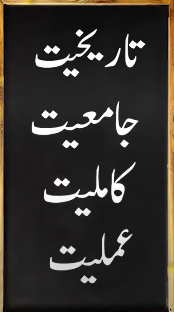
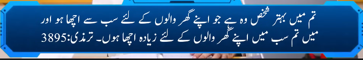
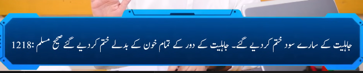

# Seerah of Prophet Muhammad [صلى الله عليه وآله وسلم] ( Lec-1 )

Beyond a shadow of doubt, the biography of Prophet Muhammad (pbuh) manifestedly represents an exhaustive embodiment of the sublime Divine Message that he communicated in order to deliver the human race from the swamp of darkness and polytheism to the paradise of light and monotheism
 
## Why Learn seerah ? 
### Rasool ki itat hi iman ka taqaza hai 

```
The Light (24:56) 

وَأَقِيمُوا۟ ٱلصَّلَوٰةَ وَءَاتُوا۟ ٱلزَّكَوٰةَ وَأَطِيعُوا۟ ٱلرَّسُولَ لَعَلَّكُمْ تُرْحَمُونَ 

Moreover, establish prayer, pay alms-tax, and obey the Messenger, so you may be shown mercy.
```


```
The Women (4:80) 

مَّن يُطِعِ ٱلرَّسُولَ فَقَدْ أَطَاعَ ٱللَّهَ ۖ وَمَن تَوَلَّىٰ فَمَآ أَرْسَلْنَـٰكَ عَلَيْهِمْ حَفِيظًۭا ٨٠

Whoever obeys the Messenger has truly obeyed Allah. But whoever turns away, then ˹know that˺ We have not sent you ˹O Prophet˺ as a keeper over them.
```

```
The Women (4:59) 

يَـٰٓأَيُّهَا ٱلَّذِينَ ءَامَنُوٓا۟ أَطِيعُوا۟ ٱللَّهَ وَأَطِيعُوا۟ ٱلرَّسُولَ وَأُو۟لِى ٱلْأَمْرِ مِنكُمْ ۖ فَإِن تَنَـٰزَعْتُمْ فِى شَىْءٍۢ فَرُدُّوهُ إِلَى ٱللَّهِ وَٱلرَّسُولِ إِن كُنتُمْ تُؤْمِنُونَ بِٱللَّهِ وَٱلْيَوْمِ ٱلْـَٔاخِرِ ۚ ذَٰلِكَ خَيْرٌۭ وَأَحْسَنُ تَأْوِيلًا ٥٩

O believers! Obey Allah and obey the Messenger and those in authority among you. Should you disagree on anything, then refer it to Allah and His Messenger, if you ˹truly˺ believe in Allah and the Last Day. This is the best and fairest resolution.
```

```
The Women (4:61) 

وَإِذَا قِيلَ لَهُمْ تَعَالَوْا۟ إِلَىٰ مَآ أَنزَلَ ٱللَّهُ وَإِلَى ٱلرَّسُولِ رَأَيْتَ ٱلْمُنَـٰفِقِينَ يَصُدُّونَ عَنكَ صُدُودًۭا ٦١

When it is said to them, “Come to Allah’s revelations and to the Messenger,” you see the hypocrites turn away from you stubbornly.
```

```
The Light (24:51) 

إِنَّمَا كَانَ قَوْلَ ٱلْمُؤْمِنِينَ إِذَا دُعُوٓا۟ إِلَى ٱللَّهِ وَرَسُولِهِۦ لِيَحْكُمَ بَيْنَهُمْ أَن يَقُولُوا۟ سَمِعْنَا وَأَطَعْنَا ۚ وَأُو۟لَـٰٓئِكَ هُمُ ٱلْمُفْلِحُونَ ٥١

The only response of the ˹true˺ believers, when they are called to Allah and His Messenger so he may judge between them, is to say, “We hear and obey.” It is they who will ˹truly˺ succeed.
```

## Some words for those who refuse Hadeeth 
-> they say that we only bleve in quraan 

->The one who does not accept Hadith, in reality, does not accept the Quran.

## Ilm-e-Asma-ul-Rijal
Ilm-e-Asma-ul-Rijal (علم اسماء الرجال) is the science of knowing the narrators of Hadith. It involves studying the biographies, character, reliability, and memory of those who transmitted Hadith, to verify the authenticity of the chain of narration (Isnad). This science helps scholars determine which Hadith are authentic (Sahih), weak (Da'if), or fabricated (Mawdu).

### 60+catogories 


### what qualities should a man have to become role model 

```
Historical background -> Authentic history 
Universality ->  comprihensive
Perfection -> perfection 
Practicality-> practicing 

```






## 3 Rasool Allah (SAW) is a blue print